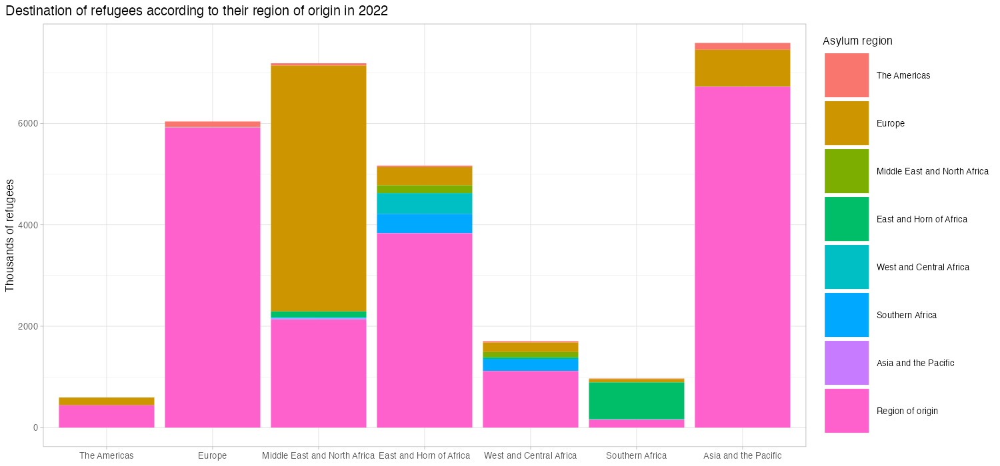

# Dataviz in R

Dataviz experiments using R.  
Mostly inspired by [tinytuesday challenges](https://github.com/rfordatascience/tidytuesday).

---

### 2023-11-19 | [tinytuesday 2023-08-22 - Refugees](https://github.com/rfordatascience/tidytuesday/blob/master/data/2023/2023-08-22/readme.md)

Work done on 2023-11-19, just started to discover R the day before 😉   
I did not spend much time on the aesthetics, but I'm happy to have done it by myself 💪  
[Code to generate the image.](tinytuesday_2023-08-22_Refugees/2023-08-22_Refugees.R)

---

[Dataviz](https://github.com/ThomasHezard/dataviz) by [Thomas Hézard](https://github.com/ThomasHezard) © 2023 is licensed under [CC BY-NC-SA 4.0](https://creativecommons.org/licenses/by-nc-sa/4.0/).  

